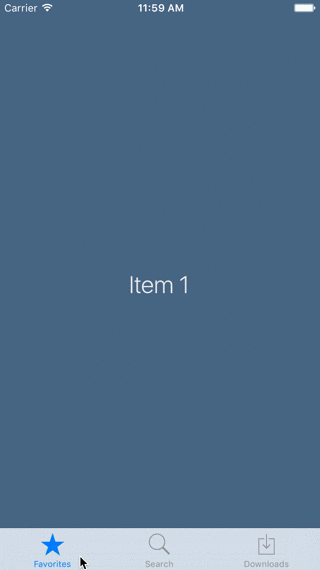

# ScrollingTabBarControllerAnimation
------------------------------------

A horizontal scrolling animation for `TabBarControllers`.
Works any number of `TabBarItem`s.

##Demo
----------
With three `TabBarItems`:

##Usage
-------

* Import `ScrollingTabBarUtils.swift` to your Xcode project
* Set your `UITabBarController`'s `delegate` to `ScrollingTabBarControllerDelegate`
* That's it!

##License
MIT, see LICENSE for details.
